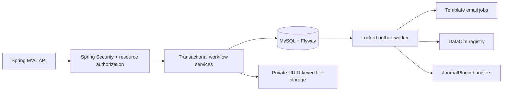
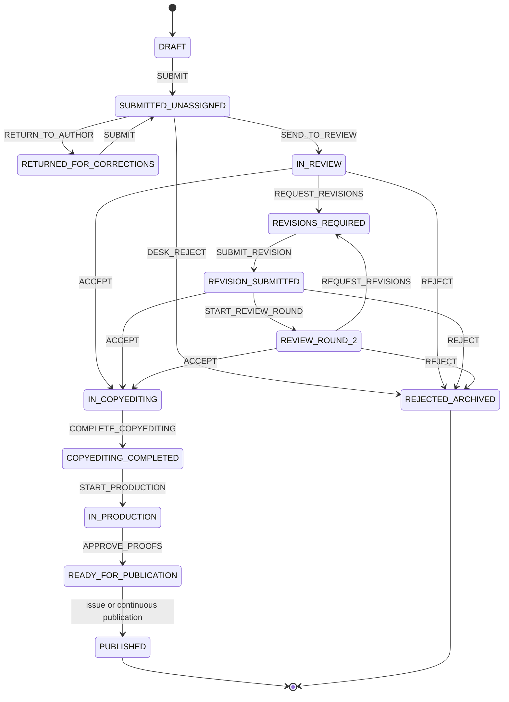
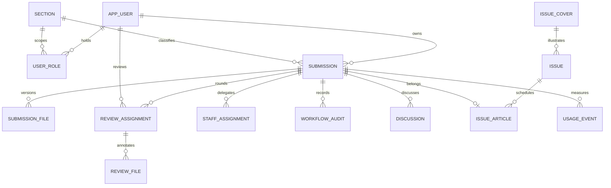

# Architecture and invariants

HTTP controllers validate transport inputs. Transactional services enforce ownership, grants, section scope, assignments, prerequisite files, and the state machine. `Store` uses parameterized JDBC; Flyway owns the relational schema. Immutable records are the internal domain, and dedicated projections determine what each caller receives. Public responses never serialize review assignments or workflow entities.

## State machine

`REVIEW_ROUND_2` denotes the repeat-review stage; `round_no` counts round 2, 3, and later. Revised author files are uploaded at `revision_no + 1`; the revision counter advances only on `SUBMIT_REVISION`. Assignments snapshot their round, revision and evaluation schema. Invitation states are `INVITED → ACCEPTED → SUBMITTED`, `INVITED → DECLINED`, or `INVITED/ACCEPTED → CANCELLED` on an editorial revision or final decision.

No generic PATCH can change a workflow state. Every state command locks its manuscript row, checks the caller's version, runs the transition table and prerequisites, writes an immutable audit event and increments the version. Each transition adds a uniquely keyed domain event in the **same transaction**. Issue publication locks the issue, then all manuscript rows in stable ID order; all articles and the issue publish together or the transaction rolls back. Scheduled articles cannot be continuously published. The issue must be unpublished when scheduling, and all linked manuscripts must already be proof-approved.

Files are immutable database records and disk objects. Multipart uploads are size-limited and signature-checked, use random storage keys, hash the exact bytes, and register rollback cleanup. Downloads resolve files through authorized records and use generic filenames, attachment disposition, `nosniff`, and a sandbox header. HTML/XML galleys are downloadable artifacts rather than executable pages. All existing galleys for the current revision are approved together by the production-to-ready transition. Once approved, no further galley upload is allowed. Uploading before approval increments the manuscript version, preventing a stale proof approval.

A process crash between a disk write and SQL commit can leave an orphan object; an operational reconciliation job should compare storage keys to committed records. Local disk requires a shared durable volume for multiple API instances. An object-store adapter and antivirus service are deployment extensions.

## Role policy

| Role | Resource policy |
|---|---|
| Reader | Public published issues/articles/galleys only |
| Author | Corresponding author owns the submission; drafts, corrections, revision uploads, own metadata/status and author/staff discussions |
| Editor, Journal Manager | Editorial decisions, reviewer/staff assignment and publication; cannot act as editor on their own manuscript |
| Section Editor | Explicit section grant **and** assigned editor ID must match the manuscript; same editorial decisions within that assignment |
| Reviewer | Their invitations/reviews only; title/abstract before acceptance; approved blinded manuscript of the assigned revision afterward |
| Copyeditor | Role plus manuscript staff assignment; metadata editing and completion in copyediting, and discussions |
| Layout Editor | Role plus assignment; galley uploads in production |
| Proofreader | Role plus assignment; final production approval; editor role alone cannot bypass proof approval |
| Site Manager | User/section/settings/template administration; editorial rights require another explicit role |

Multiple grants can coexist. Role grants are read from the database on every request, so an existing authenticated session does not retain revoked privileges. Assignment plus a current matching role is required for staff access. Administrative roles are never accepted from self-registration. There is no hardcoded demo credential.

The corresponding author's submission view maps review stages to `UNDER_REVIEW`, corrections/revisions to `REVISIONS_REQUIRED`, downstream accepted stages to `ACCEPTED`, and rejection to `REJECTED`. It never includes assignment IDs, reviewer IDs or editor-confidential answers/comments. Submitted reviewer recommendations and author-facing comments are exposed separately. In the explicit `OPEN` mode reviewer display names/ORCID become visible after a review is submitted; this is the intentional exception to blind-review anonymity.

`DOUBLE_BLIND` reviewers see only title/abstract plus approved blinded files, never full author metadata. `SINGLE_BLIND` and `OPEN` include author metadata only after invitation acceptance. An editor must upload and approve a blinded file before starting each review round in every mode. Approval freezes content during that round. This avoids relying on an author's `blind=true` flag. The service cannot prove that PDF/DOCX content is anonymized; editorial review must remove names, metadata, acknowledgements and embedded identifiers. Annotated reviewer files are private to their uploader and editorial users and are not automatically released to authors, because they may contain reviewer identities.

Discussion visibility is either `AUTHOR_STAFF` or `EDITOR_ONLY`. Reviewers cannot join those discussions. Their author-facing/editor-facing feedback is separated in their review form. Discussions are plain text threads, not a word-processing tracked-changes engine. A manuscript's coauthor list is descriptive metadata; dashboard ownership belongs to the corresponding submitting account.

## Data relationships

`GALLEY` is a specialization of `submission_file`, identified by `kind=GALLEY` and `format=PDF|HTML|JATS_XML`; it has its own identity, checksum, content type and revision association. All file categories use the same private storage and authorization infrastructure. Unique keys prevent duplicate review invitations per reviewer/round, multiple issue placement, duplicate DOI strings and duplicate outbox event keys. MySQL foreign keys prevent orphan database references.

Localized manuscript fields, section names, issue titles and UI configuration are JSON text in MySQL `LONGTEXT` columns, validated at the application boundary. They can be migrated to native MySQL JSON later without changing the API; JSONB is PostgreSQL-specific. Metadata changes and file uploads require new workflow versions. Published metadata and files are immutable through editorial APIs; asynchronous DOI registration updates the DOI and OAI datestamp.

## Operations and failure semantics

The worker locks one available outbox row using `FOR UPDATE SKIP LOCKED`, allowing multiple instances to process different jobs. Domain-event fanout queues independent email and plugin jobs. Plugins do not block workflow commits. SMTP/registry/plugin failures back off, become `DEAD` after eight attempts, and can be replayed by a manager through `/api/admin/outbox/{id}/retry`. External delivery is at least once; SMTP has no transactional acknowledgement and can duplicate mail after a crash. Plugins must deduplicate `eventId`. Registry identifiers are deterministic and PUT updates the same DOI on retries.

The current worker holds a database transaction during the bounded external request (10-second connect, 30-second read). For higher throughput use lease-based job claiming and connection-pool sizing; maintain the same idempotency contract. Daily UTC reminders target active invitations/reviews approaching a deadline within three days or overdue, deduplicated per assignment/day. Closed workflow assignments do not receive reminders.

No external integration response bodies or credentials are stored in dead-letter diagnostics. Public usage stores salted daily visitor hashes rather than raw IP addresses. The API ignores forwarded IP headers; configure a trusted reverse proxy before relying on real client addresses. Health is the only exposed Actuator endpoint. Email, DOI, ORCID, OAI signing and analytics secrets are deployment configuration, not editable public UI settings.
